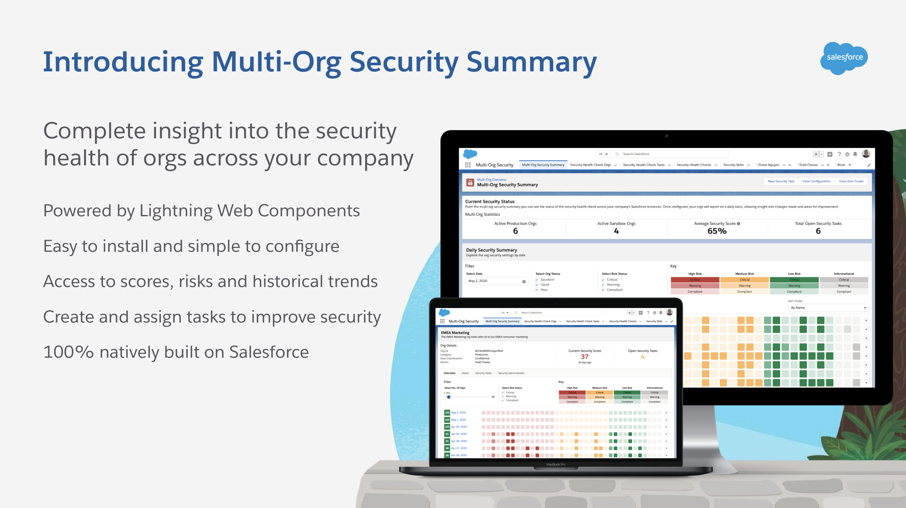

# Multi-Org Security Summary

Multi-Org Security Summary gives you the ability to bring all of the Security Health Check data from all of your Salesforce environments(production & sandbox) into a single org! This allows you to get a clear picture of the security health of your entire Salesforce program and manage your team of Admins more efficiently.



## Installing Communities Social Navigation Menu using a Scratch Org

1. If you haven't already done so, authorize your hub org and provide it with an alias (**myhuborg** in the command below):

   ```
   sfdx force:auth:web:login -d -a myhuborg
   ```

1. Clone the repository:

   ```
   git clone https://github.com/schandlergarcia/MultiOrgSecuritySummary
   cd lwc-scheduler-service
   ```

1. Create a scratch org and provide it with an alias (**multi-org-security** in the command below):

   ```
   sfdx force:org:create -s -f config/project-scratch-def.json -a multi-org-security
   ```

1. Push the app to your scratch org:

   ```
   sfdx force:source:push
   ```

1. Open the scratch org:

   ```
   sfdx force:org:open
   ```
